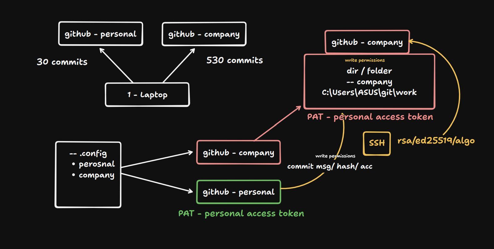

# One system multiple git accounts

let's do it

# Steps

### Add below - C:\Users\[CurrentUser]\.gitconfig

Personal Account

```yaml

[user] 
	name = Rahul Kumar 
	email = kumarrahul771996@gmail.com # Init the credential manager for Windows 
[credential] 
	helper = manager # CONDITIONAL INCLUDE # Note: Windows paths must use forward slashes (/) in .gitconfig # The /i flag makes it case-insensitive (safer for Windows) # The trailing slash is important to indicate it is a directory \
[includeIf "gitdir/i:D:/2026/work/"] 
	path = .gitconfig-work


```

### Add below - C:\Users\[CurrentUser]\.gitconfig-work

Work Account

```yaml

[user] 
	name = Jackie2026 
	email = jakiy17903@dubokutv.com 
[credential] # might need PAT or Browser login 
	namespace = company

```

- once done this directory ie: `gitdir/i:D:/2026/work/` will be treated as work directory which uses `.gitconfig-work` as its `.gitconfig`
- Everytime you go to work directory ie: `gitdir/i:D:/2026/work/` it will commit to this github acc and not you personal acc
- all the places on your laptop except for : `gitdir/i:D:/2026/work/` will be using your default account ie personal
- 

<center></center>
